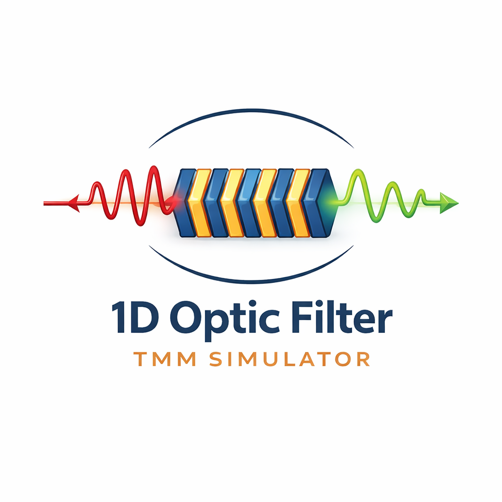

# 1D Optical Filter TMM Simulation

A powerful and user-friendly desktop application for designing and simulating 1D optical filters using the Transfer Matrix Method (TMM). This tool allows researchers and engineers to model complex multilayer thin-film structures, visualize their physical composition, and calculate their optical properties (reflection/transmission) across a spectrum of wavelengths.



## Features

*   **Advanced Material Management**:
    *   **Database Integration**: Direct access to the comprehensive [refractiveindex.info](https://refractiveindex.info/) database.
    *   **Custom Materials**: Define materials with constant complex refractive indices ($n + ik$).
    *   **File Support**: Import material data from local YAML files.
*   **Flexible Structure Definition**:
    *   **Array System**: Define reusable layer sequences (e.g., Bragg mirrors) as "Arrays".
    *   **Intuitive Syntax**: Describe filter structures using a simple text-based syntax (e.g., `(SiO2*TiO2)^5 * Cavity * (TiO2*SiO2)^5`).
    *   **Visualizer**: Real-time visual representation of the layer stack and thicknesses.
*   **Physics Engine**:
    *   Based on the Transfer Matrix Method (TMM).
    *   Supports dispersive and lossy materials.
    *   Calculates properties for arbitrary incident angles and polarizations (TE/TM).
*   **Analysis & Output**:
    *   Interactive plots of Reflection (dB) vs. Wavelength.
    *   Export simulation results to CSV for external analysis.
    *   Save and Load entire project configurations (JSON).

## Installation

### Prerequisites

*   Python 3.8 or higher
*   pip (Python package manager)

### Dependencies

Install the required Python packages using pip:

```bash
pip install PyQt5 numpy matplotlib scipy pyyaml
```

*Note: The project includes a custom version of the `PyTMM` library within the source tree, so no external installation of PyTMM is required.*

## Usage

1.  **Start the Application**:
    Navigate to the project directory and run the entry script:

    ```bash
    python run_refactored.py
    ```

2.  **Define Materials**:
    *   Use the "Material Library" section to add materials.
    *   Click "Add from Database..." to search and select real optical materials.
    *   Use "Add Custom..." for theoretical materials with constant indices.

3.  **Create Arrays (Optional)**:
    *   Define repeating structures in the "Array Definitions" section.
    *   Example: Define an array `DBR` as `SiO2*TiO2`.

4.  **Build the Filter**:
    *   In the "Optical Filter Structure" section, define your full stack.
    *   Use materials and arrays.
    *   Syntax example: `(DBR)^5 * SiO2 * (DBR)^5` creates a Fabry-Pérot cavity.
    *   Select Input (Entrance) and Output (Substrate) mediums.

5.  **Calculate**:
    *   Set the wavelength range (e.g., 400 nm to 800 nm) and incident angle.
    *   Click "Calculate" to view the Reflection spectrum.

## Project Structure

```
1D-Optic-Filter-Simulation/
├── run_refactored.py       # Main entry point for the application
├── src/                    # Application source code
│   ├── main.py             # Main GUI and application logic
│   ├── api/                # Material database integrations
│   ├── calculations/       # TMM calculation wrappers and workers
│   └── ui/                 # UI components (Dialogs, Tables)
├── PyTMM/                  # Core Transfer Matrix Method physics library
├── refractive_index_db.pickle # Cached database file (generated on first run)
└── deneme.py / tektest.py  # Usage examples and test scripts
```

## Credits & License

*   **Application Logic**: Developed for the Optical Filter Project.
*   **PyTMM Library**: The core physics engine is based on `PyTMM`.
    *   Copyright 2014-2015 Pavel Dmitriev.
    *   Distributed under the GNU General Public License v3 (GPLv3).

## Acknowledgments

*   Material data provided by the [refractiveindex.info](https://refractiveindex.info) database.
